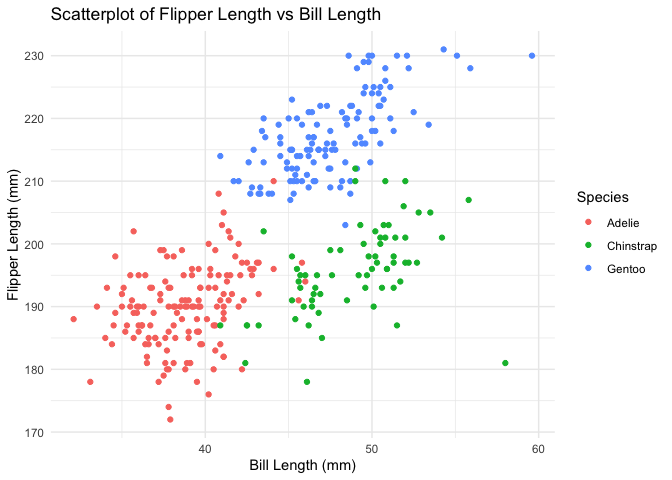

p8105_hw1_coo2124
================

## PROBLEM 1

Install and Load Package

``` r
data("penguins", package = "palmerpenguins")
```

Inline R Code to Describe the Dataset

The `penguins` dataset contains 344 rows and 8 columns, representing
data on penguins. The important variables include `species` (the species
of the penguin), `island` (the island where the penguin was observed),
`bill_length_mm` (the length of the penguin’s bill), `flipper_length_mm`
(the length of the penguin’s flipper), and `body_mass_g` (the body mass
of the penguin in grams).

The average flipper length across all penguins is 200.9152047 mm.

## Create a scatterplot of flipper length vs bill length:

``` r
library(ggplot2)

ggplot(penguins, aes(x = bill_length_mm, y = flipper_length_mm, color = species)) +
  geom_point() +
  labs(
    title = "Scatterplot of Flipper Length vs Bill Length",
    x = "Bill Length (mm)",
    y = "Flipper Length (mm)",
    color = "Species"
  ) +
  theme_minimal()
```

    ## Warning: Removed 2 rows containing missing values or values outside the scale range
    ## (`geom_point()`).

<!-- -->

## Export scatterplot using ggsave

``` r
ggsave("flipper_vs_bill_scatterplot.png")
```

    ## Saving 7 x 5 in image

    ## Warning: Removed 2 rows containing missing values or values outside the scale range
    ## (`geom_point()`).

## PROBLEM 2

Create a data frame

``` r
library(tidyverse)
```

    ## ── Attaching core tidyverse packages ──────────────────────── tidyverse 2.0.0 ──
    ## ✔ dplyr     1.1.4     ✔ readr     2.1.5
    ## ✔ forcats   1.0.0     ✔ stringr   1.5.1
    ## ✔ lubridate 1.9.3     ✔ tibble    3.2.1
    ## ✔ purrr     1.0.2     ✔ tidyr     1.3.1
    ## ── Conflicts ────────────────────────────────────────── tidyverse_conflicts() ──
    ## ✖ dplyr::filter() masks stats::filter()
    ## ✖ dplyr::lag()    masks stats::lag()
    ## ℹ Use the conflicted package (<http://conflicted.r-lib.org/>) to force all conflicts to become errors

``` r
df <- data.frame(
  normal_sample = rnorm(10),                          
  logical_vector = rnorm(10) > 0,                      
  character_vector = rep(c("a", "b", "c", "d"), length.out = 10),  
  factor_vector = factor(rep(c("low", "medium", "high"), length.out = 10))  
)

df
```

    ##    normal_sample logical_vector character_vector factor_vector
    ## 1    0.128015349           TRUE                a           low
    ## 2    0.444601687          FALSE                b        medium
    ## 3   -1.495098981           TRUE                c          high
    ## 4   -0.374549512           TRUE                d           low
    ## 5    0.001587958          FALSE                a        medium
    ## 6    0.255758124           TRUE                b          high
    ## 7    0.123564017           TRUE                c           low
    ## 8    0.701775959          FALSE                d        medium
    ## 9   -0.863353174          FALSE                a          high
    ## 10   1.105788201          FALSE                b           low

mean of each variable in the dataframe

``` r
mean(df$normal_sample)        
```

    ## [1] 0.002808963

``` r
mean(df$logical_vector)        
```

    ## [1] 0.5

``` r
mean(df$character_vector)      
```

    ## Warning in mean.default(df$character_vector): argument is not numeric or
    ## logical: returning NA

    ## [1] NA

``` r
mean(df$factor_vector)         
```

    ## Warning in mean.default(df$factor_vector): argument is not numeric or logical:
    ## returning NA

    ## [1] NA

\## What works and what doesn’t?

The mean of normal_sample worked because it’s a numeric variable. The
mean of logical_vector worked because R coerces TRUE to 1 and FALSE to
0, allowing for the calculation of a numeric mean. The mean of
character_vector did not work because the mean of a character vector can
not be taken. The mean of factor_vector did not work because factors are
categorical variables, not numeric.

## code chunk that applies the as.numeric function to the logical, character, and factor variables

``` r
as.numeric(df$logical_vector)
```

    ##  [1] 1 0 1 1 0 1 1 0 0 0

``` r
as.numeric(df$character_vector)
```

    ## Warning: NAs introduced by coercion

    ##  [1] NA NA NA NA NA NA NA NA NA NA

``` r
as.numeric(df$factor_vector)
```

    ##  [1] 2 3 1 2 3 1 2 3 1 2

## what happens when you try to take the mean?

Logical variables converted to numeric, where TRUE becomes 1 and FALSE
becomes 0. Character values cannot be directly converted to numbers,
resulting in NA. Factors are internally stored as integers corresponding
to their levels, which is why they can be converted to numeric values.
